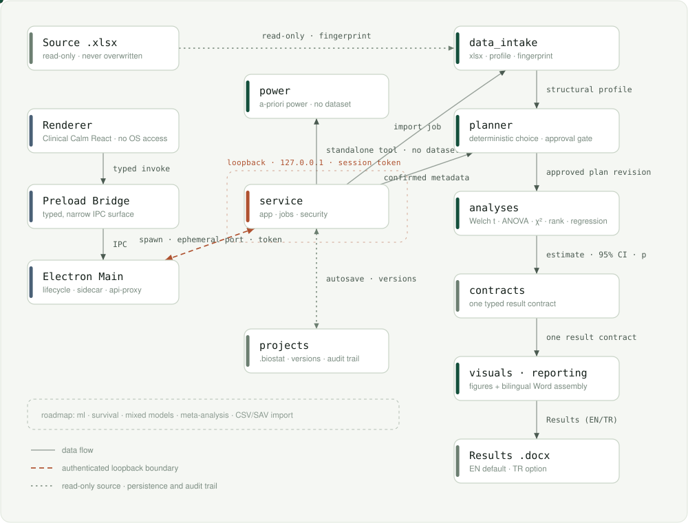

# BioStat Studio

[English](README.md) | [Türkçe](README.tr.md)

BioStat Studio is an offline-first Apple Silicon macOS application that turns a research question, an optional methodology document, an Excel dataset, and explicitly human-confirmed study metadata into a reproducible statistical analysis and a publication-ready Word Results section.

It is designed for biomedical researchers who want a guided workflow without sending patient or research data to a cloud service. The application runs independently of Codex and does not require Python after installation. Methodology AI requires Ollama and the local `qwen2.5:14b` model; when the model is unavailable, the application stays usable and falls back to its narrower rule engine.

> **Project status:** verified pre-release vertical slice. The automated scientific, security, desktop, packaging, and bilingual report gates pass. A real-dataset operator acceptance run is still required before any clinical or production use.

## What the application does

BioStat Studio guides the researcher through six explicit stages:

1. **Study brief** — record the research question, hypothesis, design, outcomes, exposures, covariates, and language. Local `qwen2.5:14b` proposes these fields from a Word, PDF, TXT, or Markdown methodology document with source evidence; every field remains editable and unconfirmed.
2. **Data and variables** — import an `.xlsx` workbook, inspect its structural profile, reconcile methodology concepts with dataset columns, and explicitly confirm variable roles and analytical kinds. Conflicts are surfaced above the variable list with document evidence and their real effect on the analysis plan.
3. **Analysis plan** — review the estimand, selected method, assumptions, warnings, planned outputs, and documented alternatives.
4. **Run and diagnose** — execute only the approved immutable plan, monitor progress, and cancel safely when needed.
5. **Results review** — inspect estimates, 95% confidence intervals, p values, effect sizes, warnings, and provenance.
6. **Word report** — export an English or Turkish `.docx` Results section with narrative, tables, figures, and a reproducibility appendix.

The source workbook is never overwritten. Every completed job is bound to the exact project snapshot, confirmed variable-role snapshot, approved plan revision, and data fingerprint used for execution.

## Verified statistical scope

The current release executes:

- variable-specific descriptive summaries and missingness counts;
- Welch independent-samples t test;
- paired t test for a confirmed two-condition repeated design;
- Welch ANOVA;
- Pearson chi-square or Fisher exact test, selected from table conditions;
- Pearson correlation and Spearman rank correlation;
- Mann–Whitney U (Hodges–Lehmann shift and rank-biserial effect);
- Wilcoxon signed-rank (pseudomedian and matched rank-biserial effect);
- Kruskal–Wallis with Holm-adjusted Dunn pairwise comparisons;
- linear regression with HC3 covariance;
- binary logistic regression;
- effect estimates, 95% confidence intervals, exact p values, and method-specific diagnostics.

Rank-based methods are never selected silently: the plan documents them as alternatives, and switching to one regenerates the plan for a new explicit approval. A deterministic a-priori **power and sample-size calculator** (two-sample and paired t tests, one-way ANOVA, two proportions, correlation) is available without touching imported data. CSV/SAV import, survival analysis, mixed models, meta-analysis, causal-inference workflows, and machine learning remain roadmap items.

Methodology matching uses local Ollama `qwen2.5:14b` as its primary engine and a deterministic rule extractor as its safe fallback. The model extracts the question, hypothesis, outcome, exposure, and covariates from the primary-analysis sentence, then matches those concepts to exact Excel column names. These classifications are not a calibrated prediction model. Until gold-set calibration is complete, LLM confidence is capped at `0.79`; the bulk-accept threshold is `0.80`, so the application never writes `confirmed=true` until the researcher reviews and explicitly accepts or edits each proposal.

## Architecture

<p align="center">
  
</p>

The dotted line marks the read-only source and the persistence/audit trail; the dashed terracotta line is the only hop that crosses the authenticated loopback boundary. `power` hangs off the service directly because it never touches an imported dataset.

> **Interactive map:** [`docs/architecture/index.html`](docs/architecture/index.html) — draggable nodes, per-module inspector, and an end-to-end flow you can replay. Open the file in a browser.

### Desktop boundary

The desktop application uses Electron and React. The renderer is sandboxed, has no Node.js access, and cannot read arbitrary filesystem paths. Native file selection and service calls pass through a narrow typed preload bridge. The Electron main process owns one-use file capabilities and adds the service authentication token outside the renderer.

### Local analysis service

Electron starts a bundled arm64 Python 3.12/FastAPI sidecar on `127.0.0.1` using an ephemeral port and a per-session bearer token. The service accepts only allowlisted operations and is stopped with the desktop application. There is no telemetry, cloud account, remote storage, or externally reachable listener.

### Scientific engine

The Python service is separated into independently tested modules:

- `methodology_intake` and `extractors` — bounded text extraction from DOCX, PDF, TXT, or Markdown, evidence-bound local Ollama proposals, and a rule-based fallback for every failure mode;
- `data_intake` — Excel loading, canonical column identities, structural profiling, and approved kinds;
- `variable_reconciliation` — conservative methodology-to-column matching, conflict detection, and planner-impact pricing on disposable confirmed role copies;
- `study_model` and `planner` — structured research metadata and deterministic, fail-closed analysis selection;
- `analyses` — verified statistical implementations and common result contracts;
- `jobs` — progress, authoritative cancellation, staged publication, and safe failure states;
- `visuals` — accessible high-resolution figures derived from the same completed job;
- `reporting` — journal-neutral English/Turkish Results prose, tables, figures, and provenance;
- `projects` — atomic local persistence, immutable source snapshots, audit records, and safe reopen/export.

## Data and security model

- Analysis is local and offline; research data do not leave the Mac.
- Imported workbooks are copied into an immutable project snapshot and fingerprinted with SHA-256.
- The original methodology file is not copied into the project. Extracted text, source name, format, and fingerprint are stored locally inside the `.biostat` project so later study and variable review can reuse the same evidence.
- Raw methodology paths never reach the renderer; one-use file capabilities are consumed by the Electron main process. Machine proposals remain unconfirmed until explicit human action.
- Ollama is called only at the fixed `127.0.0.1:11434` loopback address. Methodology text may be sent to the local model; Excel cells and patient rows are not. Variable matching receives only column names, inferred kinds, unique-value counts, and non-missing counts.
- Raw source paths, patient rows, and free-text service errors are excluded from persisted manifests and reports.
- Data structure and analysis plan require separate explicit approvals.
- A changed dataset, role snapshot, study brief, or plan invalidates downstream approvals and results.
- Results and reports are published only from a completed job; cancellation cannot expose partial output.
- English and Turkish reports are regenerated from the same immutable numerical result bundle.

BioStat Studio supports statistical work; it does not make clinical decisions and does not replace qualified methodological review.

## Word output

The report generator creates an editable `.docx` containing:

- a manuscript-ready `Results` / `Bulgular` section;
- concise non-causal statistical narrative;
- a numbered results table;
- a high-resolution, color-vision-conscious figure when supported;
- sample sizes, variable-specific missingness, estimates, 95% confidence intervals, p values, and effect sizes;
- localized warnings and a reproducibility appendix without patient-level data.

English and Turkish report fixtures are checked for numerical parity, rendered to page images for layout review, and audited for document accessibility.

## Repository layout

```text
apps/desktop/                 Electron, React, preload bridge, and desktop tests
services/analysis/            Python analysis service, statistical engine, and tests
scripts/                      Reproducible environment, packaging, and smoke checks
tests/fixtures/               Synthetic reference workbook
docs/superpowers/specs/       Approved product and architecture specification
docs/superpowers/plans/       Implementation and remediation plans
docs/architecture/            Interactive architecture map (open index.html)
docs/assets/                  Architecture diagrams used by the READMEs
```

## Development

Requirements:

- Apple Silicon Mac
- Node.js/npm
- Python 3.12 (for example, `brew install python@3.12`)
- Ollama and `qwen2.5:14b` for local-AI development and acceptance checks

From a clean checkout:

```bash
npm ci --no-audit --no-fund
bash scripts/bootstrap-analysis-venv.sh
npm run dev
```

The bootstrap script creates `services/analysis/.venv-py312`, installs the pinned dependency lock, and installs the local analysis package as a normal wheel. Its stamp includes the dependency lock, analysis source, and interpreter version.

Run the verification gates with:

```bash
npm test
npm run typecheck --workspace apps/desktop
npm run build --workspace apps/desktop
```

## Apple Silicon package

Build the standalone application and DMG with:

```bash
npm run package:mac
```

Generated artifact:

```text
release/BioStat Studio-0.1.0-arm64.dmg
```

The DMG bundles Python and the statistical engine, but not the 9 GB language model. To use local AI, start Ollama and ensure `qwen2.5:14b` is installed. If Ollama is stopped, document and Excel intake still work and the UI explicitly reports the narrower rule-based fallback.

The current package is ad-hoc signed and not notarized because no Apple Developer ID is configured. The build runs its packaged renderer/preload checks, bundled sidecar self-test, strict code-signature verification, and DMG checksum verification before publishing the artifact. macOS Gatekeeper warnings are still expected when the build is copied to another Mac. Developer ID signing, hardened runtime, and notarization are required before general distribution.

## Current validation

- Python scientific/service suite: **349 passed, 1 environment-gated skip**
- Desktop suite: **85 passed**
- TypeScript typecheck and production build: passed
- Packaged arm64 renderer/preload, bundled sidecar, strict ad-hoc signature, and DMG checksum gates: passed
- Real `Methods_Section.docx` plus the 500×54 `PassiveSurveillance.xlsx`: correct primary outcome/exposure/covariate matching with local `qwen2.5:14b`, both from source and from the service bundled inside the DMG
- Packaged-GUI acceptance with the real workbook: passed. Excel profiling remains visible while the user names the local `.biostat` project, then 500 observations, 54 variables, and the matched roles are shown for explicit human review.
- English/Turkish DOCX numerical parity and visual render review: passed
- English/Turkish DOCX accessibility audit: 0 high, 0 medium, 0 low findings

The Excel-intake GUI gate is closed. The remaining operator gate is to approve the proposed data structure, run the intended analysis, and review both language reports before scientific use.

## Roadmap

Future milestones may add broader import adapters, advanced regression and repeated-measures methods, survival analysis, mixed models, meta-analysis, causal-inference workflows, and leakage-safe exploratory biomedical machine-learning pipelines. New methods will be exposed only after reference validation, edge-case tests, diagnostics, and reporting contracts are complete.

## License

No open-source license has been selected yet. All rights are reserved unless a license file is added later.
