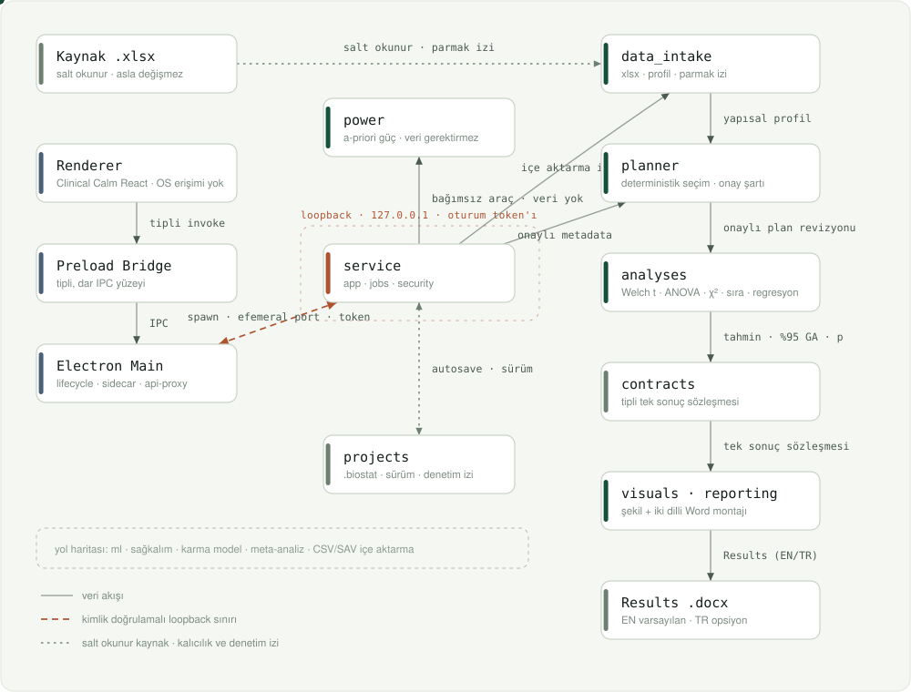

# BioStat Studio

[English](README.md) | [Türkçe](README.tr.md)

BioStat Studio; araştırma sorusunu, isteğe bağlı metodoloji belgesini, Excel veri kümesini ve insan tarafından açıkça onaylanmış çalışma bilgilerini yeniden üretilebilir bir istatistiksel analize ve yayına hazır Word Bulgular bölümüne dönüştüren, Apple Silicon macOS için çevrimdışı öncelikli bir uygulamadır.

Hasta veya araştırma verisini bir bulut hizmetine göndermeden yönlendirilmiş bir iş akışı isteyen biyomedikal araştırmacılar için tasarlanmıştır. Uygulama Codex'ten bağımsız çalışır ve kurulumdan sonra ayrıca Python yüklenmesini gerektirmez. Metodoloji yapay zekâsı için Ollama ve yerel `qwen2.5:14b` modeli gerekir; model kapalıysa uygulama çökmez, daha sınırlı kural motoruna geri döner.

> **Proje durumu:** doğrulanmış yayın öncesi dikey kesit. Otomatik bilimsel, güvenlik, masaüstü, paketleme ve iki dilli rapor kapıları geçmektedir. Klinik veya üretim kullanımından önce gerçek veriyle operatör kabul testi gereklidir.

## Uygulama ne yapar?

BioStat Studio araştırmacıyı altı açık aşamadan geçirir:

1. **Çalışma özeti** — araştırma sorusu, hipotez, tasarım, sonuçlar, maruziyetler, kovaryatlar ve dili kaydeder. Yerel `qwen2.5:14b`, Word, PDF, TXT veya Markdown metodoloji belgesinden bu alanları kanıtlarıyla önerir; her alan düzenlenebilir ve onaysız kalır.
2. **Veri ve değişkenler** — `.xlsx` çalışma kitabını içe aktarır, yapısal profili inceler, metodoloji kavramlarını veri sütunlarıyla uzlaştırır ve değişken rolleriyle analitik türleri açıkça onaylatır. Çelişkiler, belge kanıtı ve analiz planına gerçek etkileriyle değişken listesinin üzerinde gösterilir.
3. **Analiz planı** — tahmin hedefini, seçilen yöntemi, varsayımları, uyarıları, planlanan çıktıları ve belgelenmiş alternatifleri gösterir.
4. **Çalıştır ve tanıla** — yalnızca onaylanan değişmez planı yürütür, ilerlemeyi gösterir ve gerektiğinde güvenle iptal eder.
5. **Sonuçları incele** — tahminleri, %95 güven aralıklarını, p değerlerini, etki büyüklüklerini, uyarıları ve analiz kökenini sunar.
6. **Word raporu** — anlatı, tablolar, şekiller ve yeniden üretilebilirlik eki içeren İngilizce veya Türkçe `.docx` Bulgular bölümü oluşturur.

Kaynak Excel dosyasının üzerine hiçbir zaman yazılmaz. Her tamamlanmış iş; yürütmede kullanılan tam proje kopyasına, onaylanmış değişken-rolü kaydına, plan revizyonuna ve veri parmak izine bağlıdır.

## Doğrulanmış istatistik kapsamı

Mevcut sürüm şu analizleri yürütür:

- değişkene özgü betimsel özetler ve eksik veri sayıları;
- bağımsız örneklemler için Welch t testi;
- onaylanmış iki koşullu tekrarlı tasarım için eşleştirilmiş t testi;
- Welch ANOVA;
- tablo koşullarına göre Pearson ki-kare veya Fisher kesin testi;
- Pearson korelasyon ve Spearman sıra korelasyonu;
- Mann–Whitney U (Hodges–Lehmann kayması ve sıra çift-serili etki);
- Wilcoxon işaretli sıralar (psödomedyan ve eşleştirilmiş sıra çift-serili etki);
- Holm düzeltmeli Dunn ikili karşılaştırmalarıyla Kruskal–Wallis;
- HC3 kovaryanslı doğrusal regresyon;
- ikili lojistik regresyon;
- etki tahminleri, %95 güven aralıkları, kesin p değerleri ve yönteme özgü tanılar.

Sıra temelli yöntemler asla sessizce seçilmez: plan bunları alternatif olarak belgeler ve birine geçiş, yeni bir açık onay için planı yeniden oluşturur. İçe aktarılmış veriye dokunmayan belirlenimci önsel **güç ve örneklem büyüklüğü hesaplayıcısı** (iki örneklem ve eşleştirilmiş t testleri, tek yönlü ANOVA, iki oran, korelasyon) kullanılabilir. CSV/SAV aktarımı, sağkalım analizi, karma modeller, meta-analiz, nedensel çıkarım ve makine öğrenmesi yol haritasındadır.

Metodoloji eşleştirmesi yerel Ollama `qwen2.5:14b` modelini birincil, belirlenimci kural motorunu güvenli geri dönüş olarak kullanır. Model birincil analiz cümlesinden soru, hipotez, sonuç, maruziyet ve kovaryatları çıkarır; sonra bunları Excel'in gerçek sütun adlarıyla eşleştirir. Bu sınıflandırmalar kalibre edilmiş bir tahmin modeli değildir. Gold-set kalibrasyonu tamamlanana kadar LLM güveni en fazla `0.79`'dur; toplu kabul eşiği `0.80` olduğu için araştırmacı inceleyip açıkça kabul etmeden veya düzenlemeden uygulama `confirmed=true` yazmaz.

## Mimari

<p align="center">
  
</p>

Noktalı çizgi salt okunur kaynağı ve kalıcılık/denetim izini, kesikli terracotta çizgi ise kimlik doğrulamalı loopback sınırını geçen tek atlamayı işaretler. `power` doğrudan servise bağlıdır, çünkü içe aktarılan veriye hiç dokunmaz.

> **Etkileşimli harita:** [`docs/architecture/index.html`](docs/architecture/index.html) — sürüklenebilir düğümler, modül bazlı inceleme paneli ve tekrar oynatılabilir uçtan uca akış. Dosyayı tarayıcıda açın.

### Masaüstü güvenlik sınırı

Masaüstü uygulaması Electron ve React kullanır. Renderer sandbox içinde çalışır, Node.js erişimi yoktur ve rastgele dosya sistemi yollarını okuyamaz. Yerel dosya seçimi ve servis çağrıları dar, türlendirilmiş bir preload köprüsünden geçer. Tek kullanımlık dosya yetkileri Electron ana sürecindedir; servis kimlik anahtarı renderer'a verilmez.

### Yerel analiz servisi

Electron; paketlenmiş arm64 Python 3.12/FastAPI yan hizmetini `127.0.0.1` üzerinde geçici port ve oturuma özgü bearer token ile başlatır. Servis yalnızca izin verilen işlemleri kabul eder ve masaüstü uygulamasıyla birlikte kapanır. Telemetri, bulut hesabı, uzak depolama veya dışarıdan erişilebilir dinleyici yoktur.

### Bilimsel motor

Python servisi bağımsız test edilebilen modüllere ayrılır:

- `methodology_intake` ve `extractors` — DOCX, PDF, TXT veya Markdown'dan sınırlı metin çıkarımı, kanıt-bağlı yerel Ollama önerileri ve her hata durumunda kural tabanlı geri dönüş;
- `data_intake` — Excel okuma, kanonik kolon kimlikleri, yapısal profil ve onaylanan türler;
- `variable_reconciliation` — muhafazakâr metodoloji-sütun eşleştirmesi, çelişki saptama ve tek kullanımlık onaylı rol kopyalarında planner etkisi fiyatlama;
- `study_model` ve `planner` — yapılandırılmış araştırma bilgileri ve deterministik, kapalı-hata analiz seçimi;
- `analyses` — doğrulanmış istatistik uygulamaları ve ortak sonuç sözleşmeleri;
- `jobs` — ilerleme, otoritatif iptal, aşamalı yayınlama ve güvenli hata durumları;
- `visuals` — aynı tamamlanmış işten üretilen erişilebilir, yüksek çözünürlüklü şekiller;
- `reporting` — dergiden bağımsız İngilizce/Türkçe anlatı, tablo, şekil ve analiz kökeni;
- `projects` — atomik yerel kayıt, değişmez kaynak kopyaları, denetim kaydı ve güvenli yeniden açma/dışa aktarma.

## Veri ve güvenlik modeli

- Analiz yerel ve çevrimdışıdır; araştırma verisi Mac'ten çıkmaz.
- İçe aktarılan çalışma kitabı değişmez proje kopyasına alınır ve SHA-256 ile parmak izlenir.
- Özgün metodoloji dosyası projeye kopyalanmaz. Çıkarılmış metin, kaynak adı, biçim ve parmak izi; sonraki çalışma ve değişken incelemelerinde aynı kanıtın kullanılabilmesi için yerel `.biostat` projesinde saklanır.
- Ham metodoloji yolları renderer'a ulaşmaz; tek kullanımlık dosya yetkileri Electron ana sürecinde tüketilir. Makine önerileri açık insan eylemine kadar onaysız kalır.
- Ollama yalnızca sabit `127.0.0.1:11434` adresinden çağrılır. Metodoloji metni yerel modele gidebilir; Excel hücreleri ve hasta satırları gitmez. Değişken eşleştirmesinde yalnızca sütun adı, çıkarılan tür, benzersiz değer sayısı ve eksik olmayan hücre sayısı kullanılır.
- Ham kaynak yolları, hasta satırları ve serbest metin servis hataları kalıcı manifestlerden ve raporlardan dışlanır.
- Veri yapısı ve analiz planı ayrı ayrı açık onay gerektirir.
- Veri kümesi, rol kaydı, çalışma özeti veya plan değişirse sonraki onay ve sonuçlar geçersizleşir.
- Sonuç ve raporlar yalnızca tamamlanmış işten yayımlanır; iptal edilen iş kısmi çıktı gösteremez.
- İngilizce ve Türkçe raporlar aynı değişmez sayısal sonuç paketinden yeniden üretilir.

BioStat Studio istatistiksel çalışmayı destekler; klinik karar vermez ve nitelikli metodolojik incelemenin yerini almaz.

## Word çıktısı

Rapor üreticisi aşağıdakileri içeren düzenlenebilir bir `.docx` oluşturur:

- makaleye hazır `Results` / `Bulgular` bölümü;
- kısa ve nedensellik iddiası içermeyen istatistiksel anlatı;
- numaralandırılmış sonuç tablosu;
- desteklenen yöntemlerde yüksek çözünürlüklü ve renk görme farklılıklarına duyarlı şekil;
- örneklem büyüklüğü, değişkene özgü eksiklik, tahmin, %95 güven aralığı, p değeri ve etki büyüklüğü;
- yerelleştirilmiş uyarılar ve hasta düzeyinde veri içermeyen yeniden üretilebilirlik eki.

İngilizce ve Türkçe rapor örnekleri sayısal eşdeğerlik açısından test edilir, sayfa görüntülerine dönüştürülerek yerleşim açısından incelenir ve belge erişilebilirliği denetiminden geçirilir.

## Depo yapısı

```text
apps/desktop/                 Electron, React, preload köprüsü ve masaüstü testleri
services/analysis/            Python analiz servisi, istatistik motoru ve testler
scripts/                      Yeniden üretilebilir ortam, paketleme ve smoke kontrolleri
tests/fixtures/               Sentetik referans çalışma kitabı
docs/superpowers/specs/       Onaylanmış ürün ve mimari tanımı
docs/superpowers/plans/       Uygulama ve iyileştirme planları
docs/architecture/            Etkileşimli mimari haritası (index.html)
docs/assets/                  README'lerde kullanılan mimari şemaları
```

## Geliştirme

Gereksinimler:

- Apple Silicon Mac
- Node.js/npm
- Python 3.12 (örneğin `brew install python@3.12`)
- Yerel yapay zekâ geliştirme ve kabul testleri için Ollama ile `qwen2.5:14b`

Temiz bir klondan:

```bash
npm ci --no-audit --no-fund
bash scripts/bootstrap-analysis-venv.sh
npm run dev
```

Bootstrap betiği `services/analysis/.venv-py312` ortamını oluşturur, sabitlenmiş bağımlılık kilidini kurar ve yerel analiz paketini normal wheel olarak yükler. Damgası bağımlılık kilidini, analiz kaynağını ve yorumlayıcı sürümünü içerir.

Doğrulama kapıları:

```bash
npm test
npm run typecheck --workspace apps/desktop
npm run build --workspace apps/desktop
```

## Apple Silicon paketi

Bağımsız uygulama ve DMG'yi oluşturmak için:

```bash
npm run package:mac
```

Üretilen dosya:

```text
release/BioStat Studio-0.1.0-arm64.dmg
```

DMG Python ve istatistik motorunu içerir, 9 GB'lık dil modelini içermez. Yerel yapay zekâ için Ollama'yı açın ve `qwen2.5:14b` modelinin kurulu olduğundan emin olun. Ollama kapalıyken belge ve Excel içe aktarma devam eder; arayüz kural tabanlı sınırlı geri dönüşü açıkça bildirir.

Apple Developer ID yapılandırılmadığı için mevcut paket ad-hoc imzalıdır ve notarize edilmemiştir. Dosya yayımlanmadan önce paketli renderer/preload kontrolleri, gömülü yan hizmet öz testi, katı kod imzası doğrulaması ve DMG sağlama toplamı doğrulaması çalışır. Paket başka bir Mac'e kopyalandığında yine de macOS Gatekeeper uyarısı beklenir. Genel dağıtımdan önce Developer ID imzası, hardened runtime ve notarization gerekir.

## Mevcut doğrulama

- Python bilimsel/servis paketi: **349 geçti, 1 ortam koşullu atlandı**
- Masaüstü paketi: **82 geçti**
- TypeScript tür denetimi ve üretim derlemesi: geçti
- Paketli arm64 renderer/preload, gömülü yan hizmet, katı ad-hoc imza ve DMG sağlama toplamı kapıları: geçti
- Gerçek `Methods_Section.docx` + 500×54 `PassiveSurveillance.xlsx`: kaynak ve DMG içindeki paketli serviste yerel `qwen2.5:14b` ile doğru birincil sonuç/maruziyet/kovaryat eşleştirmesi geçti
- İngilizce/Türkçe DOCX sayısal eşdeğerliği ve görsel render incelemesi: geçti
- İngilizce/Türkçe DOCX erişilebilirlik denetimi: 0 yüksek, 0 orta, 0 düşük bulgu

Kalan kabul kapısı, paketli grafik arayüzde insanın önerileri görsel olarak inceleyip onaylaması ve iki dilde raporları operatör olarak değerlendirmesidir.

## Yol haritası

Sonraki aşamalarda daha geniş veri içe aktarma adaptörleri, ileri regresyon ve tekrarlı ölçüm yöntemleri, sağkalım analizi, karma modeller, meta-analiz, nedensel çıkarım iş akışları ve veri sızıntısına dayanıklı keşifsel biyomedikal makine öğrenmesi hatları eklenebilir. Yeni yöntemler ancak referans doğrulaması, sınır durum testleri, tanılar ve raporlama sözleşmeleri tamamlandıktan sonra arayüzde sunulacaktır.

## Lisans

Henüz bir açık kaynak lisansı seçilmemiştir. Daha sonra bir lisans dosyası eklenmedikçe tüm hakları saklıdır.
